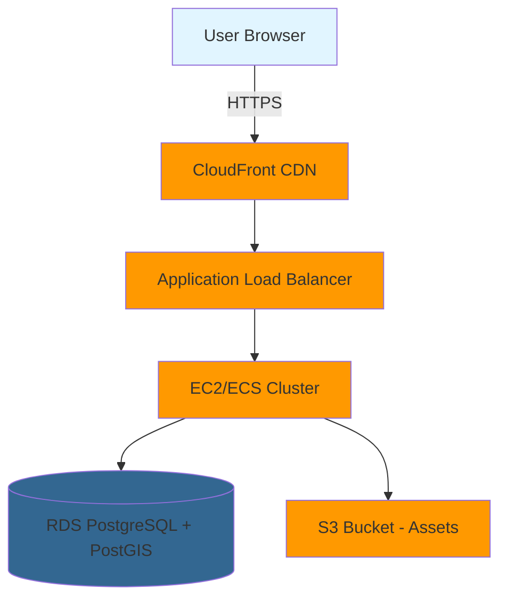

# NYC Taxi Master: The Ultimate Driver Challenge

<div align="center">


</div>

---

##  Built With

<div align="center">

### Core Technologies

<table>
<tr>
<td align="center" width="25%">

<br />
<sub><b>Cesium.js</b></sub>
<br />
<sub>3D Geospatial Visualization</sub>
</td>
<td align="center" width="25%">

<br />
<sub><b>Chart.js</b></sub>
<br />
<sub>Data Visualization</sub>
</td>
<td align="center" width="25%">

<br />
<sub><b>Turf.js</b></sub>
<br />
<sub>Geospatial Analysis</sub>
</td>
<td align="center" width="25%">

<br />
<sub><b>Node.js</b></sub>
<br />
<sub>Backend Runtime</sub>
</td>
</tr>
</table>

### Cloud Infrastructure

<table>
<tr>
<td align="center" width="20%">

<br />
<sub><b>AWS Cloud</b></sub>
</td>
<td align="center" width="20%">

<br />
<sub><b>EC2/ECS</b></sub>
</td>
<td align="center" width="20%">

<br />
<sub><b>RDS PostgreSQL</b></sub>
</td>
<td align="center" width="20%">

<br />
<sub><b>Amazon S3</b></sub>
</td>
<td align="center" width="20%">

<br />
<sub><b>PostGIS</b></sub>
</td>
</tr>
</table>

### Frontend Stack

<table>
<tr>
<td align="center" width="33%">

<br />
<sub><b>JavaScript ES6+</b></sub>
</td>
<td align="center" width="33%">

<br />
<sub><b>HTML5</b></sub>
</td>
<td align="center" width="33%">

<br />
<sub><b>CSS3</b></sub>
</td>
</tr>
</table>

</div>

---

## Technology Showcase

<div align="center">

### Cesium.js - 3D Globe Visualization

*Real-time 3D rendering of NYC with interactive taxi locations*

### Chart.js - Real-time Analytics

*Dynamic performance metrics and statistics visualization*

### AWS Architecture


</div>
## Table of Contents
- [Overview](#overview)
- [Game Concept](#game-concept)
- [Technical Architecture](#technical-architecture)
- [Game Modes](#game-modes)
- [Frontend Layout & Design](#frontend-layout--design)
- [Game Progression & Rules](#game-progression--rules)
- [Data Requirements](#data-requirements)
- [Technology Stack](#technology-stack)
- [Installation & Deployment](#installation--deployment)

---

##  Overview

**NYC Taxi Master** is an interactive web-based geo-game that challenges players to become the best taxi driver in New York City. Using real NYC taxi data, players must make strategic decisions about passenger pickups and route optimization to maximize their tips and demonstrate their knowledge of the city's streets.

### Project Goals
- Utilize NYC Taxi dataset for realistic gameplay scenarios
- Implement interactive 3D mapping with Cesium.js
- Provide engaging data visualization with Chart.js
- Deploy on AWS infrastructure with scalable database architecture
- Create an educational and entertaining experience about NYC geography and taxi operations

---

## 🚕 Game Concept

Players step into the role of a NYC taxi driver, navigating two distinct gameplay modes that test their knowledge of passenger tipping patterns and optimal routing through Manhattan's complex street grid.

### Core Questions
1. **Where should I pick up passengers to maximize tips?**
2. **Which route gets passengers to their destination fastest?**

---

## Technical Architecture

```
┌─────────────────────────────────────────────────────────┐
│                    Frontend Layer                       │
│  ┌──────────────┐  ┌──────────────┐  ┌──────────────┐   │
│  │   Cesium.js  │  │  Chart.js    │  │   HTML/CSS   │   │
│  │  (3D Maps)   │  │ (Analytics)  │  │     (UI)     │   │
│  └──────────────┘  └──────────────┘  └──────────────┘   │
└─────────────────────────────────────────────────────────┘
                          │
                          ▼
┌─────────────────────────────────────────────────────────┐
│                   Application Layer                     │
│              ┌────────────────────────┐                 │
│              │   Game Logic Engine    │                 │
│              │  - Mode Management     │                 │
│              │  - Difficulty Scaling  │                 │
│              │  - Score Calculation   │                 │
│              └────────────────────────┘                 │
└─────────────────────────────────────────────────────────┘
                          │
                          ▼
┌─────────────────────────────────────────────────────────┐
│                      AWS Cloud                          │
│  ┌──────────────┐  ┌──────────────┐  ┌──────────────┐   │
│  │   EC2/ECS    │  │   RDS/DB     │  │      S3      │   │
│  │  (Server)    │  │(Taxi Data)   │  │   (Assets)   │   │
│  └──────────────┘  └──────────────┘  └──────────────┘   │
└─────────────────────────────────────────────────────────┘
```

### Database Schema (Preliminary)
```sql
-- Taxi pickup locations with tip data
taxi_locations (
  id, latitude, longitude, avg_tip, 
  pickup_count, time_of_day, zone
)

-- Route segments for Mode 2
route_segments (
  id, start_lat, start_lon, end_lat, end_lon,
  avg_duration, avg_speed, traffic_factor
)

-- Player statistics
player_stats (
  session_id, mode, score, accuracy,
  questions_answered, difficulty_level, timestamp
)
```

---

##  Game Modes

### Mode 1: Tip Maximization Challenge
**Objective:** Select the pickup location that yields the highest tips

#### Gameplay Flow
1. **Initial Setup**
   - 10 different locations displayed on 3D map (Cesium)
   - Each location shows waiting passengers
   - Player has 2 minutes to answer 5 questions

2. **Question Format**
   ```
   "Which passenger location will give you the highest tip?"
   
   [Location A] [Location B] [Location C] ... [Location J]
   ```

3. **Feedback Mechanism**
   - ✅ Correct Answer: Animated taxi pickup with success sound
   - ❌ Wrong Answer: Feedback animation with guidance
   - Real-time score update on Chart.js dashboard

4. **Difficulty Progression**
   - **Level 1-2:** Obvious differences (e.g., $2 vs $8 average tip)
   - **Level 3-4:** Moderate differences ($5 vs $7 average tip)
   - **Level 5:** Minimal differences ($6.50 vs $6.80 average tip)
   - Resets every 5 questions

### Mode 2: Optimal Route Challenge
**Objective:** Select the fastest route between two points

#### Gameplay Flow
1. **Route Selection**
   - Player inputs start and end coordinates
   - System validates NYC boundaries
   - If outside: Warning message + request new points
   - If valid: System generates route options

2. **Route Generation Algorithm**
   ```
   1. Find nearest graph nodes to player's selected points
   2. Connect selected points to graph network
   3. Calculate 5 distinct paths using:
      - Shortest distance
      - Fastest time (considering traffic)
      - Balanced route
      - Scenic route (longer but smoother)
      - Alternative path
   4. Ensure path diversity (no duplicate routes)
   ```

3. **Question Format**
   ```
   "Which route gets your passenger there fastest?"
   
   Display 5 routes on map with:
   - Estimated duration
   - Distance
   - Visual path overlay (color-coded)
   ```

4. **Path Coherence**
   - All 5 routes must be realistic alternatives
   - No illogical detours
   - Based on actual road network topology

---

##  Frontend Layout & Design

### Landing Page (Tutorial Screen)
```
┌────────────────────────────────────────────────────────┐
│                  NYC TAXI MASTER                       │
│          "How Good of a Taxi Driver Are You?"          │
├────────────────────────────────────────────────────────┤
│                                                        │
│  ┌──────────────────────────────────────────────┐      │
│  │         [Tutorial Carousel]                  │      │
│  │                                              │      │
│  │  Slide 1: Welcome & Game Concept             │      │
│  │  Slide 2: Mode 1 - Tip Maximization          │      │
│  │  Slide 3: Mode 2 - Route Optimization        │      │
│  │  Slide 4: Controls & Scoring                 │      │
│  │                                              │      │
│  │         [< Previous]  [Next >]               │      │
│  └──────────────────────────────────────────────┘      │
│                                                        │
│              ┌─────────────────────┐                   │
│              │   LET'S START!      │                   │
│              └─────────────────────┘                   │
│                                                        │
└────────────────────────────────────────────────────────┘
```

### Main Game Interface
```
┌────────────────────────────────────────────────────────────────┐
│  [Mode 1: Tips] [Mode 2: Routes]    Score: 850   Time: 1:45    │
├────────────────────────────────────────────────────────────────┤
│                                                                │
│  ┌─────────────────────────────────┐  ┌─────────────────────┐  │
│  │                                  │  │   STATISTICS        │ │
│  │       CESIUM 3D MAP              │  │                     │ │
│  │    (NYC with taxi locations      │  │  Chart.js Dashboard │ │
│  │     or route visualizations)     │  │                     │ │
│  │                                  │  │  - Accuracy Rate    │ │
│  │                                  │  │  - Avg Response Time│ │
│  │                                  │  │  - Difficulty Level │ │
│  │                                  │  │  - Question Progress│ │
│  │                                  │  │                     │ │
│  └─────────────────────────────────┘  └─────────────────────┘  │
│                                                                │
│  ┌──────────────────────────────────────────────────────────┐  │
│  │  Question 3/5: Which location has the highest tip avg?   │  │
│  │                                                          │  │
│  │  [Location A] [Location B] [Location C] ... [Location J] │  │
│  └──────────────────────────────────────────────────────────┘  │
│                                                                │
└────────────────────────────────────────────────────────────────┘
```

### Wireframe Sketches

#### Tutorial Flow
```
┌─────────┐    ┌─────────┐    ┌─────────┐    ┌─────────┐
│ Welcome │ -> │ Mode 1  │ -> │ Mode 2  │ -> │ Controls│
│  Info   │    │ Tutorial│    │ Tutorial│    │ & Rules │
└─────────┘    └─────────┘    └─────────┘    └─────────┘
                                                    │
                                                    v
                                            ┌──────────────┐
                                            │ START GAME!  │
                                            └──────────────┘
```

#### Mode 1 Screen Layout
```
     Header Bar (Mode Selector + Score + Timer)
     ┌─────────────────────────────────────────┐
     │ [Mode 1 Active] [Mode 2]  Score: 450    │
     │                           Time: 1:23    │
     └─────────────────────────────────────────┘
     
Left Column (Map)          Right Column (Stats)
┌──────────────────┐      ┌────────────────┐
│                  │      │   Performance  │
│   Cesium 3D      │      │                │
│   NYC Map        │      │   Chart.js     │
│                  │      │   Graphs       │
│   [10 Pickup     │      │                │
│    Locations     │      │   - Accuracy   │
│    Marked]       │      │   - Streak     │
│                  │      │   - Level      │
└──────────────────┘      └────────────────┘

     Bottom Bar (Question Interface)
     ┌─────────────────────────────────────────┐
     │ Q: Select highest tip location          │
     │ [Loc A] [Loc B] [Loc C] ... [Loc J]     │
     └─────────────────────────────────────────┘
```

#### Mode 2 Screen Layout
```
     Header Bar (Mode Selector + Score + Timer)
     ┌─────────────────────────────────────────┐
     │ [Mode 1] [Mode 2 Active]  Score: 720    │
     │                           Time: 0:58    │
     └─────────────────────────────────────────┘
     
Left Column (Map)          Right Column (Stats)
┌──────────────────┐      ┌────────────────┐
│                  │      │   Route Stats  │
│   Cesium 3D      │      │                │
│   NYC Map        │      │   Chart.js     │
│                  │      │                │
│   [5 Routes      │      │   Route 1: 15m │
│    Color-coded:  │      │   Route 2: 18m │
│    Route 1-5     │      │   Route 3: 17m │
│    displayed]    │      │   Route 4: 20m │
│                  │      │   Route 5: 16m │
└──────────────────┘      └────────────────┘

     Bottom Bar (Question Interface)
     ┌─────────────────────────────────────────┐
     │ Q: Which route is fastest?              │
     │ [Route 1] [Route 2] ... [Route 5]       │
     └─────────────────────────────────────────┘
```

---

##  Game Progression & Rules

### Difficulty Levels

| Level | Mode 1 Criteria | Mode 2 Criteria | Points per Correct |
|-------|----------------|-----------------|-------------------|
| 1 | Tip difference > $3 | Time difference > 5 min | 100 pts |
| 2 | Tip difference $2-3 | Time difference 3-5 min | 150 pts |
| 3 | Tip difference $1-2 | Time difference 2-3 min | 200 pts |
| 4 | Tip difference $0.50-1 | Time difference 1-2 min | 250 pts |
| 5 | Tip difference < $0.50 | Time difference < 1 min | 300 pts |

### Lives & Time Management
- **Lives:** None - Game continues until time expires
- **Time Limit:** 2 minutes per 5-question set
- **Time Expiry:** Score resets to 0, difficulty resets to Level 1
- **Question Progress:** Must complete 5 questions before switching modes

### Mode Switching Rules
```
Can Switch Modes When:
✓ Completed 5 questions in current mode
✓ Timer has expired (with reset)

Cannot Switch Modes When:
✗ Questions 1-4 completed (must finish to Q5)
✗ Mid-question (answer pending)
```

### Scoring System
```javascript
Base Score = Level × 50 × Correct Answers
Time Bonus = (Remaining Seconds / 120) × 100
Accuracy Bonus = (Correct / Total) × 200

Final Score = Base Score + Time Bonus + Accuracy Bonus
```

### Audio & Animation System

#### Sound Effects
| Event | Sound |
|-------|-------|
| Correct Answer | Cash register "cha-ching!" |
| Wrong Answer | Buzzer tone |
| Mode Switch | Taxi horn |
| Level Up | Success chime |
| Time Warning (30s left) | Ticking clock |
| Game Over | Taxi engine stop |

#### Animations
| Trigger | Animation Description |
|---------|----------------------|
| Correct Answer (Mode 1) | 3D taxi drives to selected location, passenger enters, thumbs up icon appears with tip amount |
| Wrong Answer (Mode 1) | Selected location marker shakes, correct location glows green |
| Correct Answer (Mode 2) | Camera follows selected route in fast-forward, success confetti |
| Wrong Answer (Mode 2) | Incorrect route fades out, correct route highlights in green |
| Mode Switch | 3D camera smoothly transitions between map views, mode banner slides in |
| Level Up | Map zoom effect + difficulty badge appears |

---

##  Data Requirements

### NYC Taxi Dataset Fields Needed

#### For Mode 1 (Tip Analysis)
```json
{
  "pickup_location": {
    "latitude": "float",
    "longitude": "float",
    "zone_name": "string"
  },
  "tip_amount": "float",
  "total_amount": "float",
  "pickup_datetime": "timestamp",
  "passenger_count": "int"
}
```

#### For Mode 2 (Route Optimization)
```json
{
  "pickup_location": {
    "latitude": "float",
    "longitude": "float"
  },
  "dropoff_location": {
    "latitude": "float",
    "longitude": "float"
  },
  "trip_duration": "int (seconds)",
  "trip_distance": "float (miles)",
  "traffic_conditions": "string",
  "pickup_datetime": "timestamp"
}
```

### Data Processing Pipeline
```
Raw NYC Taxi Data (CSV/Parquet)
        ↓
Data Cleaning & Validation
        ↓
Geographic Clustering (K-means for pickup zones)
        ↓
Route Graph Construction (NetworkX)
        ↓
AWS RDS Database Import
        ↓
API Endpoints for Game Logic
```

### NYC Boundary Validation
```javascript
// NYC Bounding Box
const NYC_BOUNDS = {
  minLat: 40.4774,
  maxLat: 40.9176,
  minLon: -74.2591,
  maxLon: -73.7004
};

function isWithinNYC(lat, lon) {
  return lat >= NYC_BOUNDS.minLat && 
         lat <= NYC_BOUNDS.maxLat &&
         lon >= NYC_BOUNDS.minLon && 
         lon <= NYC_BOUNDS.maxLon;
}
```

---

##  Technology Stack

### Frontend Technologies

#### Cesium.js


**Purpose:** 3D geospatial visualization
- Render NYC in 3D with terrain
- Display taxi pickup locations as interactive markers
- Visualize routes with colored polylines
- Camera animations for transitions
- Entity clustering for performance

**Key Features Used:**
- `Cesium.Viewer` - Main 3D globe interface
- `Cesium.Entity` - Taxi markers and route paths
- `Cesium.GeoJsonDataSource` - NYC boundary visualization
- `Cesium.Camera.flyTo()` - Smooth transitions between views

```javascript
// Example: Taxi marker creation
viewer.entities.add({
  position: Cesium.Cartesian3.fromDegrees(longitude, latitude),
  billboard: {
    image: 'taxi-icon.png',
    scale: 0.5
  }
});
```

#### Chart.js


**Purpose:** Real-time statistics and performance visualization

**Charts Implemented:**
1. **Accuracy Rate** (Doughnut Chart)
2. **Response Time** (Line Chart)
3. **Difficulty Level** (Progress Bar)
4. **Question Progress** (Bar Chart)

```javascript
// Example: Accuracy chart
new Chart(ctx, {
  type: 'doughnut',
  data: {
    labels: ['Correct', 'Incorrect'],
    datasets: [{
      data: [correct, incorrect],
      backgroundColor: ['#4CAF50', '#F44336']
    }]
  }
});
```

### Backend Technologies

#### AWS Services Architecture

```
┌─────────────────────────────────────────────────┐
│              AWS Cloud Infrastructure           │
│                                                 │
│  ┌─────────────┐      ┌──────────────┐          │
│  │   Route 53  │──────│     ALB      │          │
│  │    (DNS)    │      │(Load Balance)│          │
│  └─────────────┘      └──────────────┘          │
│                              │                  │
│                              v                  │
│  ┌────────────────────────────────────────┐     │
│  │           EC2 / ECS Cluster            │     │
│  │  ┌──────────┐  ┌──────────┐            │     │
│  │  │  Node.js │  │  Node.js │            │     │
│  │  │  Server  │  │  Server  │            │     │
│  │  └──────────┘  └──────────┘            │     │
│  └────────────────────────────────────────┘     │
│                              │                  │
│                              v                  │
│  ┌─────────────────────────────────────────┐    │
│  │          Amazon RDS (PostgreSQL)        │    │
│  │    - Taxi location data                 │    │
│  │    - Route segments                     │    │
│  │    - Player statistics                  │    │
│  └─────────────────────────────────────────┘    │
│                                                 │
│  ┌─────────────────────────────────────────┐    │
│  │              Amazon S3                  │    │
│  │    - Static assets (images, sounds)     │    │
│  │    - Frontend build files               │    │
│  └─────────────────────────────────────────┘    │
│                                                 │
│  ┌─────────────────────────────────────────┐    │
│  │           CloudFront (CDN)              │    │
│  │    - Global content delivery            │    │
│  │    - SSL/TLS termination                │    │ 
│  └─────────────────────────────────────────┘    │
└─────────────────────────────────────────────────┘
```

### Additional Libraries

| Library | Version | Purpose |
|---------|---------|---------|
| Turf.js | 6.5.0 | Geospatial calculations (distance, nearest point) |
| NetworkX | 3.1 | Graph construction for route optimization |
| Express.js | 4.18 | Backend API server |
| PostgreSQL | 15.0 | Relational database |
| PostGIS | 3.3 | Spatial database extension |

---

##  Installation & Deployment

### Prerequisites
```bash
- Node.js >= 18.0.0
- npm >= 9.0.0
- AWS CLI configured
- PostgreSQL 15+ with PostGIS extension
- NYC Taxi dataset (2024-2025)
```

### Local Development Setup
```bash
# Clone repository
git clone https://github.com/yourusername/nyc-taxi-master.git
cd nyc-taxi-master

# Install dependencies
npm install

# Setup environment variables
cp .env.example .env
# Edit .env with your AWS credentials and DB connection

# Initialize database
npm run db:migrate
npm run db:seed

# Start development server
npm start
```

### AWS Deployment
```bash
# Build frontend
npm run build

# Deploy to S3
aws s3 sync ./dist s3://nyc-taxi-master-bucket

# Deploy backend to EC2/ECS
# (Use AWS CodeDeploy or manual deployment)

# Configure RDS
# - Create PostgreSQL instance
# - Enable PostGIS extension
# - Import taxi data via dump file
```

### Environment Variables
```env
# AWS Configuration
AWS_REGION=us-east-1
AWS_ACCESS_KEY_ID=your_access_key
AWS_SECRET_ACCESS_KEY=your_secret_key
S3_BUCKET=nyc-taxi-master-assets

# Database
DB_HOST=your-rds-endpoint.amazonaws.com
DB_PORT=5432
DB_NAME=nyc_taxi_game
DB_USER=admin
DB_PASSWORD=your_secure_password

# Cesium
CESIUM_ION_TOKEN=your_cesium_token

# Application
NODE_ENV=production
PORT=3000
```

---

##  Future Enhancements

### Phase 2 Features
- [ ] Multiplayer mode with real-time competition
- [ ] Daily challenges with leaderboards
- [ ] Historical data comparison (2019 vs 2024 taxi patterns)
- [ ] Weather integration affecting route difficulty
- [ ] Achievement system with badges
- [ ] Social sharing of high scores

### Advanced Analytics
- [ ] Machine learning model for tip prediction
- [ ] Dynamic difficulty adjustment based on player performance
- [ ] Heat maps of optimal pickup zones by time of day
- [ ] Traffic pattern prediction for Mode 2

### Mobile Optimization
- [ ] Responsive design for tablets and phones
- [ ] Touch-friendly interface
- [ ] Reduced 3D complexity for mobile devices
- [ ] Progressive Web App (PWA) support

---